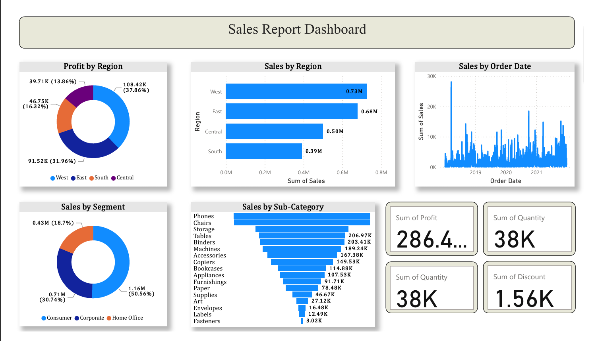

📊 Sales Report Dashboard

This repository contains a Sales Report Dashboard built using Power BI for analyzing sales performance across different regions, segments, and product categories. The dashboard provides clear visual insights into sales trends, profits, and key business metrics.

📌 Dashboard Overview

🔹 Key Insights:

Profit by Region – Profit distribution across West, East, South, and Central regions.

Sales by Region – Comparison of sales performance across different regions.

Sales by Order Date – Time-series trend analysis of sales over multiple years.

Sales by Segment – Sales contribution from Consumer, Corporate, and Home Office segments.

Sales by Sub-Category – Top-performing product sub-categories such as Phones, Chairs, and Storage.

KPI Cards – Highlighting important business metrics:

Total Profit: 286.4K

Total Quantity: 38K

Total Discount: 1.56K

## 📊 Dashboard Preview  

